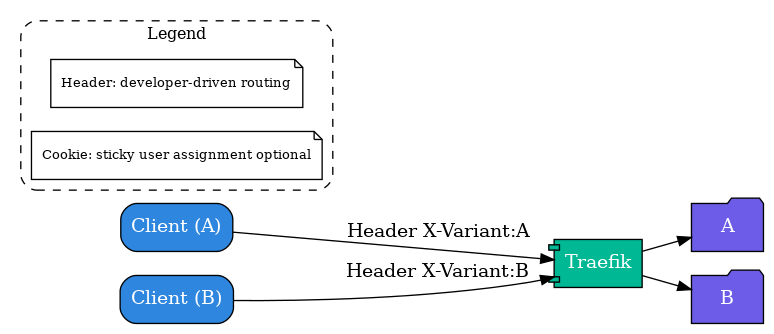
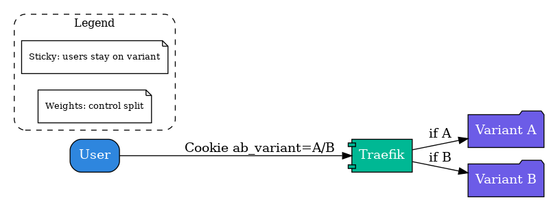

# Deployment Strategies Lab

This repository contains multiple implementations of modern **deployment strategies** for backend applications,
using **Docker, Traefik, and Kubernetes**.  
The aim is to provide hands-on examples for each strategy and demonstrate their application in real-world systems.

---

## Implemented Strategies

### 1. **AB Testing**
- Purpose: Route different subsets of users to different versions based on attributes (e.g., cookies, headers).
- Tools: **Traefik (file provider)**.
- 
- Diagram:
  
  

- 

---

### 2. **Blue-Green Deployment**
- Purpose: Run two environments (Blue and Green) simultaneously; switch traffic from one to another.
- Tools: **Traefik**, **Docker Compose**.
- Derived Strategies:
    - **Recreate**: Similar to Blue-Green but instead of switching traffic, the old version is stopped before the new one starts.
- Diagram:
  

---

### 3. **Canary Release**
- Purpose: Gradually shift traffic from the stable version to the new one, monitoring for issues before full rollout.
- Tools: **Traefik weighted services**.
- Diagram:
  

---

### 4. **Dark Launch (Shadow Traffic)**
- Purpose: Send a copy of production traffic to a new service for testing without impacting users.
- Tools: **Traefik mirroring**.
- Diagram:
  

---

### 5. **Feature Toggle**
- Purpose: Enable/disable features without deploying new code.
- Tools: **Spring Boot**, **Docker Compose**, **Traefik**.
- Diagram:
  

---

### 6. **Rolling Update (Kubernetes)**
- Purpose: Incrementally update pods with the new version while keeping the service available.
- Tools: **Kubernetes Deployments**.
- Note: Rolling Updates are implemented on **Kubernetes** using **Minikube**.
    - For any Kubernetes-based deployment strategy, we can **refer to Rolling Update** as the baseline setup.
- Diagram:
  

---

### 7. **Shadow Indexing**
- Purpose: Test a new indexing/search system in parallel with the production one.
- Tools: **Custom backend**, **parallel index processing**.
- Diagram:
  

---

## Derived (Not Implemented) Strategies

The following strategies are **not explicitly implemented** in code here but can be **derived** from the implemented ones:

| Strategy | Derived From | Notes |
|----------|--------------|-------|
| **Recreate** | Blue-Green | Shut down old version before starting the new one. |
| **A/B/N Testing** | AB Testing | Extend AB Testing to multiple variants beyond 2 versions. |
| **Canary + Feature Toggle** | Canary, Feature Toggle | Canary rollout combined with per-user feature flags. |
| **Shadow Launch with Gradual Shift** | Dark Launch, Canary | Shadow traffic followed by gradual live rollout. |

---

## Kubernetes Reference

- **Rolling Update** is implemented in Kubernetes as a reference for any other Kubernetes-based strategy.
- You need **Minikube** or a Kubernetes cluster to run Kubernetes examples locally.
- Setup for local testing:
```bash
minikube start
kubectl apply -f rolling-update/deployment.yaml
```

---

## Repository Structure

```
deployment-lab/
├── ab-testing/             # AB Testing deployment example
├── backend-template-base/  # Common backend code for all strategies
├── blue-green-lab/         # Blue-Green Deployment
├── canary-lab/             # Canary Release
├── dark-launch/            # Dark Launch (Shadow Traffic)
├── feature-toggle-lab/     # Feature Toggle
├── rolling-update/         # Rolling Update (Kubernetes)
├── shadow-indexing-lab/    # Shadow Indexing
```

---

## How to Run (Docker Examples)

Example for Blue-Green:
```bash
cd blue-green-lab
docker compose up -d --build
```

Example for Feature Toggle:
```bash
cd feature-toggle-lab
docker compose up -d --build
```

---

## How to Run (Kubernetes Example - Rolling Update)

```bash
minikube start
kubectl apply -f rolling-update/deployment.yaml
kubectl apply -f rolling-update/service.yaml
```

---

## Diagrams

All diagrams for each strategy are stored in `docs/diagrams`.

---
