# Deployment Strategies Lab

This repository contains multiple implementations of modern **deployment strategies** for backend applications,
using **Docker, Traefik, and Kubernetes**.  
The aim is to provide hands-on examples for each strategy and demonstrate their application in real-world systems.


# Deployment Strategies Lab — Consolidated Guide

This repository contains hands-on labs for multiple deployment strategies implemented using **Docker**, **Traefik**, and in some cases **Kubernetes**.

Each strategy includes:
- Full working code (Spring Boot backend services, Traefik reverse proxy configuration, and Docker Compose setup)
- A detailed README explaining the strategy, steps to run, production considerations, and example configurations.
- Diagrams showing the traffic flow and cutover process.

---

## Strategies

### 1. [Blue–Green Deployment](blue-green-lab/README.md)
Run two versions (Blue & Green) side-by-side. Flip traffic instantly between them via Traefik config.  
✅ Benefits: Zero-downtime, instant rollback, no mixed-version state.


---

### 2. [Canary Deployment](canary-lab/README.md)
Gradually shift traffic from the old version to the new version in small increments (e.g., 10%, 30%, 50%, etc.) before full rollout.  
✅ Benefits: Gradual exposure, better risk management.

```mermaid

flowchart LR
    
  %% --- Canary ---
  subgraph CN["Canary"]
    direction LR
    U2["Users"] --> CANA{"% Canary"}
    CANA -- "Small %" --> CV["Canary Version 🐤"]
    CANA -- "Rest" --> SV["Stable Version"]
    CV --> MON["Monitor"]
    MON --> DEC{"Healthy?"}
    DEC -- "Yes" --> ROLL["Rollout More"]
    DEC -- "No" --> RB2["Rollback"]
  end
```




---

### 3. [Dark Launch (Shadow Traffic)](dark-launch/README.md)
Mirror live traffic to a new version without impacting users. The shadow version runs silently for validation.  
✅ Benefits: Real traffic testing without user risk.


---

### 4. [Rolling Update](rolling-update/README.md)
Replace instances of the old version with the new version gradually, without requiring double capacity.  
✅ Benefits: Balanced resource usage, no downtime.


---

### 5. [Feature Toggle Deployment](feature-toggle-lab/README.md)
Deploy features hidden behind toggles; enable or disable them dynamically without redeploying.  
✅ Benefits: Decouple deployment from release, safer experiments.


---

### 6. [A/B Testing Deployment](ab-testing/README.md)
Route users to different versions based on rules (e.g., 50% to A, 50% to B) to test features and measure results.  
✅ Benefits: Data-driven decision-making.

```mermaid
flowchart LR
%% --- A/B Testing ---
    subgraph AB["A/B Testing"]
        direction LR
        U1["Users 👥"] --> ST1{"Split Traffic"}
        ST1 -- "50%" --> VA1["Version A 🚀"]
        ST1 -- "50%" --> VB1["Version B ⚡"]
        VA1 --> MA1["Metrics A 📊"]
        VB1 --> MB1["Metrics B 📈"]
        MA1 --> CR1{"Compare"}
        MB1 --> CR1
        CR1 -- "Winner" --> DW1["Deploy 🏆"]
        CR1 -- "No Winner" --> RB1["Rollback 🔄"]
    end

```



---

### 7. [Shadow Indexing Deployment](shadow-indexing-lab/README.md)
Run a new indexing or processing pipeline alongside the old one, compare outputs without affecting production results.  
✅ Benefits: Validate changes in background.


---

## Common Tools & Components

- **[Traefik](https://doc.traefik.io/traefik/)** — Reverse proxy, routing, load balancing.
- **Spring Boot** — Backend REST services.
- **Docker Compose** — Multi-service local environments.
- **Kubernetes** — For some strategies (e.g., rolling updates in K8s).

---

## How to Navigate

- Each lab is in its own folder (e.g., `blue-green-lab/`, `canary-lab/`).
- Each lab contains its own `README.md` and runnable code.
- `Docs/` folder contains global documentation and diagrams (`deployment_strategy_diagrams/`).

---

## Running a Lab

```bash
cd blue-green-lab   # or any other strategy folder
docker compose up --build
```

Follow the lab-specific README for verification steps and strategy explanation.

---

## Diagrams

Visual diagrams for all strategies are available in:  
[deployment_strategy_diagrams/](deployment_strategy_diagrams/)

---

## License

This project is licensed under the MIT License.

---

## Derived (Not Implemented) Strategies

The following strategies are **not explicitly implemented** in code here but can be **derived** from the implemented ones:

| Strategy | Derived From | Notes |
|----------|--------------|-------|
| **Recreate** | Blue-Green | Shut down old version before starting the new one. |
| **A/B/N Testing** | AB Testing | Extend AB Testing to multiple variants beyond 2 versions. |
| **Canary + Feature Toggle** | Canary, Feature Toggle | Canary rollout combined with per-user feature flags. |
| **Shadow Launch with Gradual Shift** | Dark Launch, Canary | Shadow traffic followed by gradual live rollout. |

---

## Kubernetes Reference

- **Rolling Update** is implemented in Kubernetes as a reference for any other Kubernetes-based strategy.
- You need **Minikube** or a Kubernetes cluster to run Kubernetes examples locally.
- Setup for local testing:
```bash
minikube start
kubectl apply -f rolling-update/deployment.yaml
```

---

## Repository Structure

```
deployment-lab/
├── ab-testing/             # AB Testing deployment example
├── backend-template-base/  # Common backend code for all strategies
├── blue-green-lab/         # Blue-Green Deployment
├── canary-lab/             # Canary Release
├── dark-launch/            # Dark Launch (Shadow Traffic)
├── feature-toggle-lab/     # Feature Toggle
├── rolling-update/         # Rolling Update (Kubernetes)
├── shadow-indexing-lab/    # Shadow Indexing
```

---

## How to Run (Docker Examples)

Example for Blue-Green:
```bash
cd blue-green-lab
docker compose up -d --build
```

Example for Feature Toggle:
```bash
cd feature-toggle-lab
docker compose up -d --build
```

---

## How to Run (Kubernetes Example - Rolling Update)

```bash
minikube start
kubectl apply -f rolling-update/deployment.yaml
kubectl apply -f rolling-update/service.yaml
```

---

## Diagrams

All diagrams for each strategy are stored in `docs/diagrams`.

---
