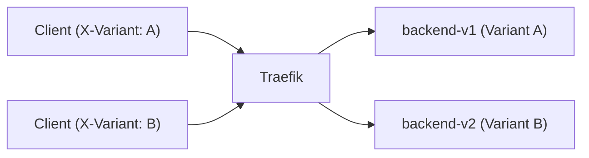

# A/B Testing Deployment (Traefik + Docker)

This lab demonstrates **A/B testing** using Traefik as the reverse proxy. Two versions of the same Spring Boot service run side-by-side and traffic is routed based on a header (`X-Variant`) to allow controlled experiments.

## Why A/B Testing?

- **Data-driven decisions.** Route a subset of users to a new experience and compare metrics.
- **Controlled exposure.** You decide exactly who sees which version.
- **Safe rollouts.** Keep both versions live until you have enough data.

> This pattern is common in feature experiments, UX trials, and conversion optimization.

## High-level flow

1) **Variant A** (v1) and **Variant B** (v2) both run.
2) Routing is based on a header sent by the client (`X-Variant: A` or `X-Variant: B`).
3) Clients see exactly one variant per request (or persist via sticky cookies).
4) Metrics are collected separately for A and B.



## Project layout

```
ab-testing-lab/
├─ docker-compose.yml
├─ traefik/
│  ├─ traefik.yml          # static config (entrypoints, providers, dashboard)
│  ├─ dynamic.yml          # header-based A/B routing
│  └─ dynamic-cookie.yml   # cookie-based sticky A/B routing
├─ backend-v1/             # Spring Boot app: /api/version -> "Hello from v1"
│  ├─ Dockerfile
│  └─ src/...
└─ backend-v2/             # Spring Boot app: /api/version -> "Hello from v2"
   ├─ Dockerfile
   └─ src/...
```

**Ports**
- **:80**  → user traffic (router: `web`)
- **:8080** → Traefik dashboard (`/dashboard/`)

---

## Run the lab

```bash
docker compose up --build
```

Open the dashboard: **http://localhost:8080/dashboard/**  
You should see `backend-v1@docker`, `backend-v2@docker`, and two routers `app-a` and `app-b`.

---

## Test header-based routing (default)

The `traefik/dynamic.yml` file contains:

```yaml
http:
  routers:
    app-a:
      rule: "Host(`localhost`) && Header(`X-Variant`,`A`)"
      entrypoints: [web]
      service: backend-v1@docker
    app-b:
      rule: "Host(`localhost`) && Header(`X-Variant`,`B`)"
      entrypoints: [web]
      service: backend-v2@docker
```

Now test:

```bash
# Send request to Variant A (backend-v1)
curl -H "X-Variant: A" http://localhost/api/version
# -> Hello from v1 (A)

# Send request to Variant B (backend-v2)
curl -H "X-Variant: B" http://localhost/api/version
# -> Hello from v2 (B)
```

Without the `X-Variant` header, no router matches → 404 (by design).

---

## Switch to cookie-based sticky routing

If you want each client to “stick” to the same variant without sending headers, use `dynamic-cookie.yml`:

```bash
cp traefik/dynamic-cookie.yml traefik/dynamic.yml
docker compose restart traefik
```

`dynamic-cookie.yml`:

```yaml
http:
  routers:
    app:
      rule: "Host(`localhost`)"
      entrypoints: [web]
      service: ab-cookie

  services:
    ab-cookie:
      weighted:
        sticky:
          cookie:
            name: ab_variant
            httpOnly: true
        services:
          - name: backend-v1@docker
            weight: 5
          - name: backend-v2@docker
            weight: 5
```

### Test cookie mode
```bash
# First request — see Set-Cookie header
curl -i http://localhost/api/version

# Repeat with same cookie — should hit same backend
curl --cookie "ab_variant=<value>" http://localhost/api/version
```

Adjust weights to control traffic split, e.g., `7` / `3`.

---

## Observability & verification

- Traefik dashboard → see routers `app-a`, `app-b` (header mode) or `app` (cookie mode).
- `/api/version` endpoint shows which backend handled the request.
- Metrics/logging → split results by header or cookie.

---

## Production considerations

1. **Metrics** — tie backend logs to variant for accurate measurement.
2. **Persistence** — header mode is stateless, cookie mode provides per-user stickiness.
3. **Traffic shaping** — adjust weights gradually to roll out the winner.
4. **Security** — don’t trust variant headers for security decisions; treat as experiment input only.
5. **Fallback** — define a default route if header/cookie is missing.
