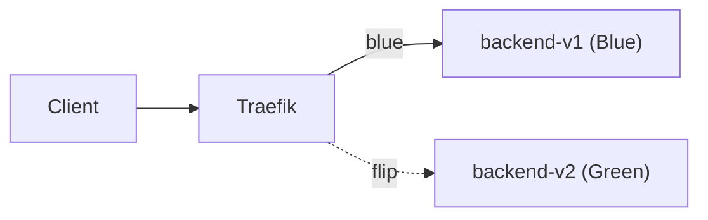

# Blue-Green Deployment (Traefik + Docker)

This lab demonstrates **Blue–Green** deployment using Traefik as the reverse proxy. Two versions of the same Spring Boot service run side-by-side and traffic is switched instantly by changing Traefik’s dynamic config.

## Why Blue–Green?

- **Zero/near-zero downtime releases.** Deploy Green alongside Blue; flip traffic in one step.
- **Fast rollback.** If something breaks, flip back immediately.
- **No “half migrated” users.** Avoids mixed fleets during deploys.

> Blue–Green is widely used across clouds and CI/CD stacks (AWS/Azure/GCP blue–green features, Kubernetes + Ingress controllers, Argo Rollouts). The pattern scales from laptop demos to prod.

## High-level flow

1) **Blue** (v1) is live.
2) **Green** (v2) is deployed off the main path.
3) Smoke test Green (health, version).
4) **Flip** Traefik routing from Blue → Green.
5) Monitor. If bad—**flip back**.



## Project layout

```
blue-green-lab/
├─ docker-compose.yml
├─ traefik/
│  ├─ traefik.yml       # static config (entrypoints, providers, dashboard)
│  └─ dynamic.yml       # you toggle/weight services here
├─ backend-v1/          # Spring Boot app: /api/version -> "Hi! I am blue!"
│  ├─ Dockerfile
│  └─ src/...
└─ backend-v2/          # Spring Boot app: /api/version -> "Hi I am green!"
   ├─ Dockerfile
   └─ src/...
```

**Ports**
- **:80**  → user traffic (router: `web`)
- **:8080** → Traefik dashboard (`/dashboard/`)

---

## Run the lab

```bash
docker compose up --build
```

Open the dashboard: **http://localhost:8080/dashboard/**  
You should see services `backend-v1@docker`, `backend-v2@docker`, and your router.

### Verify backends directly (optional)

These curls run *inside* each container (apps listen on `8080`):

```bash
# v1
docker exec -it blue-green-lab-backend-v1-1 curl -s http://localhost:8080/api/version
# -> Hi! I am blue!

# v2
docker exec -it blue-green-lab-backend-v2-1 curl -s http://localhost:8080/api/version
# -> Hi I am green!
```

### Route **all traffic to Blue** (baseline)

In `traefik/dynamic.yml`:

```yaml
http:
  routers:
    blue-green-router:
      rule: "Host(`localhost`)"
      entryPoints: ["web"]
      service: backend-v1@docker   # <-- all traffic to Blue

  services: {}  # we use services discovered from the Docker provider
```

Traefik watches the file and hot-reloads. Then:

```bash
curl -H "Host: localhost" http://localhost/api/version
# Hi! I am blue!
```

### **Flip** to Green

Change the router’s service to `backend-v2@docker`:

```yaml
service: backend-v2@docker
```

Test again:

```bash
curl -H "Host: localhost" http://localhost/api/version
# Hi I am green!
```

**Rollback**: change the service back to `backend-v1@docker` (instant).

---

## Optional: controlled cutover (weights)

Use a weighted service before committing to all-Green:

```yaml
http:
  routers:
    blue-green-router:
      rule: "Host(`localhost`)"
      entryPoints: ["web"]
      service: blue-green-service

  services:
    blue-green-service:
      weighted:
        services:
          - name: backend-v1@docker
            weight: 9
          - name: backend-v2@docker
            weight: 1
# sticky:
#   cookie: {}   # enable if you require session affinity
```

Progression idea: **90/10 → 50/50 → 0/10**, then switch router to `backend-v2@docker` only.

> **Note:** With `sticky` enabled, the same client may keep hitting the same backend. Disable it for demos where you want to *see* both versions from one browser.

---

## Observability & verification

- **Health**: `/actuator/health`, Traefik dashboard shows “UP/Status”.
- **Smoke**: `/api/version` (plus your own probes).
- **Signals**: error rate, p95 latency, logs after flipping.

---

## Production considerations

1. **DB migrations**
    - Use **expand → deploy → contract**: make schema backward-compatible, deploy Green, flip, remove legacy pieces later.
    - Avoid destructive migrations during the flip window.

2. **State & sessions**
    - Prefer stateless services.
    - If sessions, use Redis/shared store or Traefik **sticky** sessions.
    - File uploads → object storage (S3/GCS) or a shared volume.

3. **Long-running requests**
    - Use connection draining / graceful shutdown.
    - Tune timeouts.

4. **TLS & headers**
    - Terminate TLS at Traefik (Let’s Encrypt).
    - Ensure JWT/CORS headers are correct between frontend ↔ proxy ↔ backend.

5. **Feature flags**
    - Gate risky features so the same artifact can behave “blue” or “green” via config.

6. **Access control**
    - The flip should be a pipeline-controlled change (RBAC), not a public toggle.
    - Consider WAF / rate limits.

---

## Who uses Blue–Green?

- **Cloud platforms**: first-class blue–green on AWS, Azure, GCP.
- **Kubernetes**: flip a Service/Ingress between Deployments; Ingress controllers (Traefik/NGINX) + GitOps (Argo CD) make it declarative.
- **CI/CD tools**: common strategy for high-availability SaaS.

**TL;DR:** A mature, boring-and-good pattern when you can run two copies at once and want instant rollback.

---

## Appendix: sample `dynamic.yml` variants

**All Blue**
```yaml
http:
  routers:
    blue-green-router:
      rule: "Host(`localhost`)"
      entryPoints: ["web"]
      service: backend-v1@docker
```

**All Green**
```yaml
http:
  routers:
    blue-green-router:
      rule: "Host(`localhost`)"
      entryPoints: ["web"]
      service: backend-v2@docker
```

**Weighted 90/10**
```yaml
http:
  routers:
    blue-green-router:
      rule: "Host(`localhost`)"
      entryPoints: ["web"]
      service: blue-green-service
  services:
    blue-green-service:
      weighted:
        services:
          - name: backend-v1@docker
            weight: 9
          - name: backend-v2@docker
            weight: 1
```
