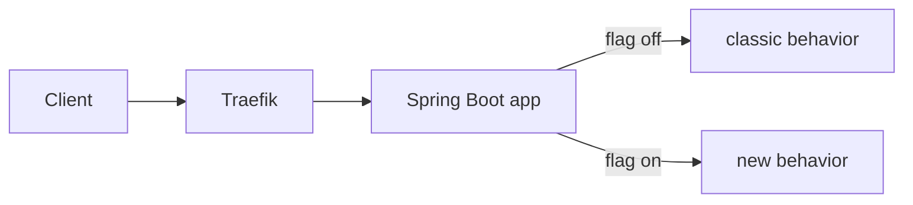

# Feature Toggles (Flags) — Traefik + Docker + Spring Boot

This lab shows **feature toggles** implemented at the **application layer** with:
- a **global** toggle from environment/config, and
- a **per-request override** using the `X-Features` header (for targeted experiments).

## Why Feature Toggles?

- **Ship dark code** safely; enable when ready.
- **Decouple deploy from release.**
- **Target cohorts** (beta users, internal staff) without redeploying.

> This lab avoids external flag services for simplicity; in prod, consider Unleash, LaunchDarkly, or Flagsmith.

## High-level flow

1) One service is running.
2) The code checks a **global flag** `feature.newGreeting` and an **optional** per-request header.
3) The endpoint `/api/greeting` renders the “new” or “classic” path accordingly.



## Project layout

```
feature-toggles-lab/
├─ docker-compose.yml
├─ traefik/
│  ├─ traefik.yml
│  └─ dynamic.yml          # routes /api/* to backend
└─ backend/                # Spring Boot app with flags
   ├─ Dockerfile
   └─ src/...
```

**Ports**
- **:80** → user traffic (`/api/*`)
- **:8080** → Traefik dashboard

---

## Run

```bash
docker compose up --build -d
```

### Baseline (flag off)
```bash
curl -s http://localhost/api/greeting | jq
# "newGreetingEnabled": false
```

### Per-request override (targeted)
```bash
curl -s -H "X-Features: newGreeting" http://localhost/api/greeting | jq
# "newGreetingEnabled": true
```

### Global toggle on
Edit `docker-compose.yml`:
```yaml
environment:
  - FEATURE_NEW_GREETING=true
```
And set the Spring property in container:
```bash
# Option A: rebuild/start with env
docker compose up -d --build
```
Then:
```bash
curl -s http://localhost/api/greeting | jq
# "newGreetingEnabled": true
```

---

## Observability

- `/api/features` → shows global flag state.
- `/api/version` → smoke test.

---

## Production notes

- Keep flags **short-lived**; clean up after rollout.
- Store targeting rules centrally (feature flag platform).
- Guard DB migrations & risky paths behind flags.
- Use A/B tests or progressive rollout to validate before enabling globally.
