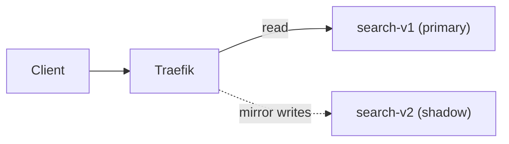
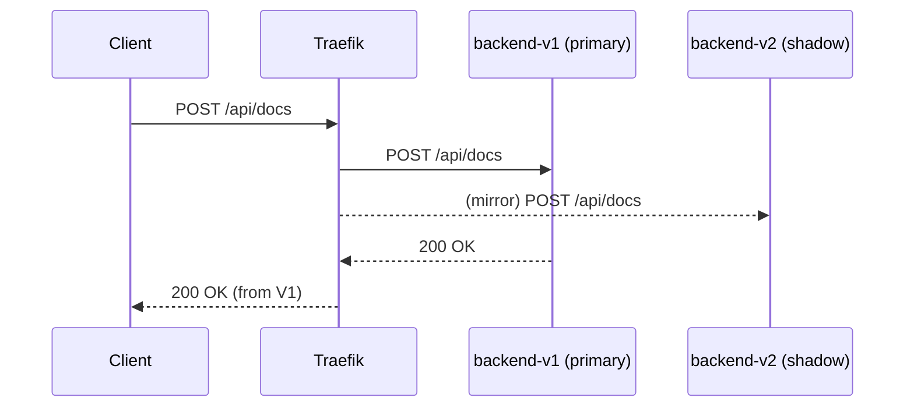
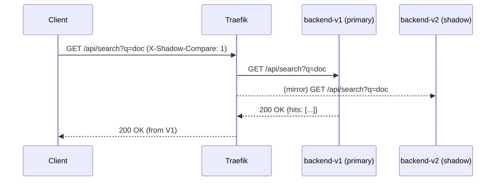

# Shadow Indexing — Dual-Write & Read-Compare (Traefik + Docker)

This lab demonstrates **both** shadow indexing patterns:

1) **Dual-Write (Index Build)**: mirror index **writes** to a **shadow index** (v2) while search **reads** continue hitting **primary** (v1).
2) **Read-Compare**: search **reads** go to primary; optionally mirror reads to shadow with a header for **side-by-side** comparison.

## Why Shadow Indexing?

- Safely migrate index implementations (e.g., different analyzers/schemas).
- Validate relevancy/latency on the new index in production-like load.
- Avoid impacting users until confidence is high.



## Project layout

```
shadow-indexing-lab/
├─ docker-compose.yml
├─ traefik/
│  ├─ traefik.yml
│  ├─ dynamic.yml                 # DEFAULT: dual-write (POST/DELETE /api/docs mirrored)
│  └─ dynamic-read-compare.yml    # optional: mirror GET /api/search with header
├─ backend-v1/                    # primary index
└─ backend-v2/                    # shadow index
```

**Ports**
- **:80** → app traffic
- **:8080** → Traefik dashboard

---

## Run

```bash
docker compose up --build -d
```

Check versions:
```bash
curl -s http://localhost/api/version
# {"service":"shadow-index-demo","version":"v1"}
```

---

## Mode 1 — Dual-Write (default)

Add docs — **mirrored** to v2, response from v1:
```bash
curl -s -X POST http://localhost/api/docs -H 'Content-Type: application/json' -d '{"text":"elastic search"}' | jq
curl -s -X POST http://localhost/api/docs -H "Content-Type: application/json" -d '{"text":"full text indexing"}' | jq
```

Search — **reads** hit **primary**:
```bash
curl -s "http://localhost/api/search?q=text" | jq
```

Verify v2 received mirrored docs (inside v2 container):
```bash
docker compose exec backend-v2 curl -s "http://localhost:8080/api/index" | jq
```

Reset both indices:
```bash
curl -s -X DELETE http://localhost/api/docs | jq
docker compose exec backend-v2 curl -s -X DELETE http://localhost:8080/api/docs | jq
```

---

## Mode 2 — Read-Compare

Switch routing to **read-compare**:
```bash
cp traefik/dynamic-read-compare.yml traefik/dynamic.yml
docker compose restart traefik
```

Seed primary only:
```bash
curl -s -X DELETE http://localhost/api/docs | jq
curl -s -X POST http://localhost/api/docs -H 'Content-Type: application/json' -d '{"text":"primary only doc"}' | jq
```

Baseline read:
```bash
curl -s "http://localhost/api/search?q=doc" | jq
```

Now mirror reads by header (still responds from v1):
```bash
curl -s -H 'X-Shadow-Compare: 1' "http://localhost/api/search?q=doc" | jq
```

Compare outputs:
```bash
V1=$(curl -s "http://localhost/api/search?q=doc" | jq -S '.hits')
V2=$(docker compose exec backend-v2 curl -s "http://localhost:8080/api/search?q=doc" | jq -S '.hits')
diff <(echo "$V1") <(echo "$V2") || true
```

---

## Production notes

- For large indexes, dual-write via **CDC** or job-based reindexing; use checksums to detect drift.
- Read-compare should sample a **fraction** of queries to control load.
- Track p95 latency & result diffs (size, Jaccard similarity, top-K overlap).
- Cut over with **Blue–Green** or **Canary** once shadow meets SLOs.


---

# How it works (Traefik v3)

Traefik provides two features we rely on:

1. **Mirroring** — duplicate a request to a secondary service. The **response** is always returned from the **primary**.
2. **Routing rules** — match by method, path prefix, and headers to control when mirroring is on.

### Dual-Write (default: `traefik/dynamic.yml`)
- `GET /api/search` → **primary**
- `POST /api/docs`, `DELETE /api/docs` → **mirrored** to shadow



### Read-Compare (optional: `traefik/dynamic-read-compare.yml`)
- `GET /api/search` → **primary** only
- `GET /api/search` + `X-Shadow-Compare: 1` → mirror the same read to **v2** (for logs/metrics)



---

## Request routing table

| Route matcher                                                | Service used | Mirrors to | Notes |
| --- | --- | --- | --- |
| `Method(GET) && PathPrefix(/api/search)`                     | `primary`    | —         | Normal reads served by v1 |
| `Header(X-Shadow-Compare, 1) && GET /api/search`             | `primary`    | `candidate` | Response from v1; v2 receives a copy |
| `Method(POST|DELETE) && PathPrefix(/api/docs)` (dual-write)  | `mirror`     | `candidate` | Writes mirrored to v2; response from v1 |
| `/api/version`, `/api/index`                                 | `primary`    | —         | Utility endpoints |

---

## Config snippets (reference)

**Static (traefik.yml)**
```yaml
entryPoints:
  web: { address: ":80" }
  traefik: { address: ":8080" }
api: { dashboard: true, insecure: true }
providers:
  docker: { exposedByDefault: false }
  file: { filename: /etc/traefik/dynamic.yml }
```

**Dual-Write (dynamic.yml)**
```yaml
http:
  routers:
    reads:
      rule: "Host(`localhost`) && PathPrefix(`/api/search`) && Method(`GET`)"
      entrypoints: [web]
      service: primary
    writes:
      rule: "Host(`localhost`) && PathPrefix(`/api/docs`) && (Method(`POST`) || Method(`DELETE`))"
      entrypoints: [web]
      service: mirror
    index-inspect:
      rule: "Host(`localhost`) && PathPrefix(`/api/index`)"
      entrypoints: [web]
      service: primary
    version:
      rule: "Host(`localhost`) && PathPrefix(`/api/version`)"
      entrypoints: [web]
      service: primary

  services:
    primary:
      loadBalancer:
        servers: [{ url: "http://backend-v1:8080" }]
    candidate:
      loadBalancer:
        servers: [{ url: "http://backend-v2:8080" }]
    mirror:
      mirroring:
        service: primary
        mirrors:
          - name: candidate
            percent: 100
```

**Read-Compare (dynamic-read-compare.yml)** — diff vs dual-write
```yaml
http:
  routers:
    reads:
      rule: "Host(`localhost`) && PathPrefix(`/api/search`) && Method(`GET`)"
      entrypoints: [web]
      service: primary
    read-compare:
      rule: "Host(`localhost`) && PathPrefix(`/api/search`) && Method(`GET`) && Header(`X-Shadow-Compare`,`1`)"
      entrypoints: [web]
      service: mirror
    writes:
      rule: "Host(`localhost`) && PathPrefix(`/api/docs`) && (Method(`POST`) || Method(`DELETE`))"
      entrypoints: [web]
      service: primary
```

---

## Testing cheat sheet

```bash
# Versions
curl -s http://localhost/api/version | jq

# Add docs (Dual-Write)
curl -s -X POST http://localhost/api/docs -H 'Content-Type: application/json' -d '{"text":"alpha beta"}' | jq

# Search (served by v1)
curl -s "http://localhost/api/search?q=beta" | jq

# Inspect v2 (inside container)
docker compose exec backend-v2 curl -s http://localhost:8080/api/index | jq

# Switch to Read-Compare
cp traefik/dynamic-read-compare.yml traefik/dynamic.yml && docker compose restart traefik

# Mirror a read (response from v1)
curl -s -H 'X-Shadow-Compare: 1' "http://localhost/api/search?q=alpha" | jq
```

---

## Metrics & verification ideas

- **Correctness drift**
    - % of queries where `hits_v1 != hits_v2` (size or content)
    - Top‑K overlap / Jaccard similarity of result sets
- **Performance**
    - p50/p95/p99 latency for v2 vs v1
    - Indexing lag (time from write to queryable)
- **Reliability**
    - Error rates on v2 (5xx, timeouts)
    - Mirror delivery success rate

**Tip:** Add a background comparer that samples requests (e.g., 1%) and emits structured logs like:
```
shadow_compare query=alpha hits_v1=3 hits_v2=3 overlap=1.0 p95_v2=12ms
```

---

## Migration playbook

1. **Snapshot & bootstrap v2**
    - Bulk load the current v1 index into v2.
2. **Enable Dual-Write**
    - Mirror writes to keep indexes in sync.
3. **Shadow reads (Read-Compare)**
    - Mirror a **small %** of reads; compare outputs & latency.
4. **Fix deltas**
    - Tweak analyzers, relevance, or data bugs until drift is acceptable.
5. **Graduated exposure**
    - Canary a small % of real reads to v2 (actual responses), watch SLOs.
6. **Cutover**
    - Flip Blue–Green or weights to send 100% to v2.
7. **Decommission v1**
    - After a cool‑down, remove v1 and clean configs.

---

## Troubleshooting

- **404/No route:** check `dynamic.yml` rules (host/path), and restart Traefik.
- **v2 not receiving mirrors:** verify service names, `mirroring` block, and Traefik dashboard (**HTTP → Services**).
- **Hitting the wrong port:** app traffic is on port **80**; **8080** is Traefik’s dashboard.
- **Docker discovery off:** with `exposedByDefault: false`, each backend must have `traefik.enable=true` and a `loadbalancer.server.port` label (if you use the Docker provider directly).
- **State divergence:** reset indices and re-run dual-write; consider idempotent writes.

---

## Security notes

- Shadowed requests include **full user payloads**; ensure v2 has the same data protection controls.
- Mask PII in logs; treat mirrors like production traffic.
- Rate-limit read-compare mirroring so you don’t amplify traffic.

---

## What next?

- Add a **server-side diff endpoint** that queries v1 and v2 and returns a diff summary.
- Export metrics to Prometheus/Grafana to graph drift and latency over time.
- Automate the cutover with a CI/CD pipeline (GitOps: flip the `dynamic.yml` target as a PR).
